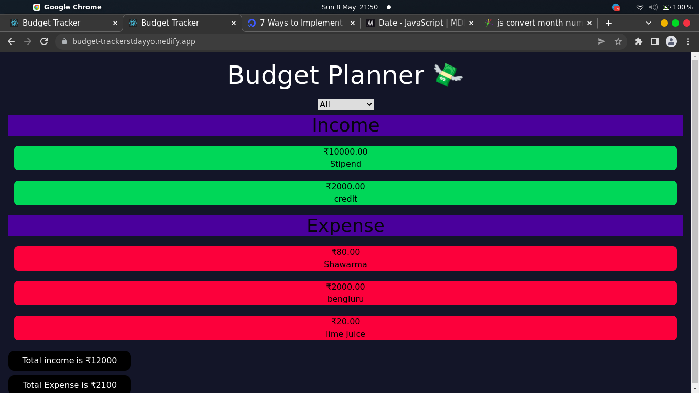

<h2>TinkerHub Saturday HackNight - Budget Planner</h2>

As part of the Saturday Hacknight organised by Tinkerhub, we created a Budget Planner, where you can track your monthly expenses and income. This React app retrieves data enterd in Notion using **Notion API**. 

## Background
A personal or household budget is a summary that compares and tracks your income and expenses for a defined period, typically one month. Most people tend to spend money unaware of their budget and is often left with empty hands by month-end. A budget planner can help us visualise our monthly expense and income and lets us spend wisely. 

## LIVE DEMO
A live demo of this project can be viewed here:

https://budget-trackerstdayyo.netlify.app/

## Tech / Framework Used
- React
- Notion API

## Screenshots
</img>
 
</img>